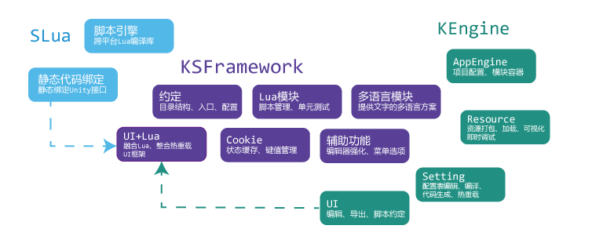

[**K**Engine](https://github.com/mr-kelly/KEngine) + [**S**Lua](https://github.com/mr-kelly/slua) | [XLua](https://github.com/Tencent/xLua) | [ILRuntime](https://github.com/Ourpalm/ILRuntime)+ **Framework** = KSFramework

**[KSFramework](https://github.com/mr-kelly/KSFramework)是一个整合KEngine、SLua/XLua/ILRuntime 的Unity3D Asset Bundle开发框架，并为程序、美术、策划、运营提供辅助工具集。**

---------------------

### Sponsor

[维格表vika.cn](https://vika.cn)，支持API的数据表，完美实时协同，可用于丝滑般的项目管理、游戏策划配置表、数据整理等1000+场景。

### ShowCase(商业案例)

showcase 列表：https://github.com/mr-kelly/KSFramework/wiki

| [仙剑奇侠传4手游](http://www.9game.cn/xjqxcs/)    | [天域幻想](http://www.9game.cn/xjhmjh/)    | [巴清传](http://hh.sdo.com/w2/) | [少年剑影](http://www.9game.cn/shaonianjianying/)  | [撞击女神](http://u.360.cn/zjns_1) | [七七捕鱼](http://www.9game.cn/qiqibuyu/) |
| ----------- | ----------- |----------- |----------- | ----------- | ----------- |
|  |  |   |  |  |  |
| 命运抉择VR | [我的冒险屋](https://www.taptap.com/app/200744) | Moba游戏                                                     |                                                              |  |  |
|  |  | 开发中 |  |  |  |

### KSFramework

**热重载**是KSFramework的开发重点——在不重启游戏的前提下，重载代码、配置表可立刻看到修改效果，最大限度的提升开发、调试的速度，方便运营阶段热更新。

对于程序人员，可以使用AssetBundle加载与打包、脚本化的UI、配置表代码自动生成、下载更新等基础功能模块，大大减少游戏周边基础功能的工作量；

对于策划人员，使用Excel进行编辑，可以在编辑过程中添加注释、图标、预编译指令，KSFramework会根据配置内容自动生成代码供程序使用。

对于美术人员，只需将项目需要用到资源放到指定目录，将会自动的生成Asset Bundle；程序加载Asset Bundle跟Resources.Load一样方便。

对于运营人员，利用KSFramework的热重载特性，可以针对运营需求，在项目运行过程中配置表、脚本代码在用户无知觉的情况下进行热更新。

## Quick Start

### 方式1，下载即用

以下方法任选其一：

- 方法一：把源码**git clone**到本地（推荐）：  https://github.com/mr-kelly/KSFramework.git

- 方法二：在项目页面点击 **Clone or download**  选择 **Download ZIP** 

### 方式2，从产品包安装

（这种方式获得的版本非最新版本），您可以从[KSFramework Release](https://github.com/mr-kelly/KSFramework/releases)页面下载最新版本的产品包。

解压后直接用Unity打开KSFramework目录，或直接双击场景KSFramework/Assets/Game.unity。

> 如遇到无法下载的网络问题, 备选下载站:
>
> - [KSFramework Appveyor Artifacts](https://ci.appveyor.com/project/mr-kelly/ksframework/branch/master/artifacts): 包含每次提交的构建结果
> - [KSFramework OSChina镜像](http://git.oschina.net/mrkelly/KSFramework)): 国内的镜像Git

### Unity3D版本支持

| Unity3D版本 | 支持情况 | 备注                                         |
| ----------- | -------- | -------------------------------------------- |
| Unity 4.X   | 支持     | 请使用KEngine                                |
| Unity 5.x   | 支持     | 部分版本的API有差异，建议使用5.3.7及以上版本 |
| Unity 2017  | 支持     |                                              |
| Unity 2018  | 支持     | 2018.2.7f1已测试                             |
| Unity 2019  | 支持     | 2019.3.7f1已测试                             |
| Unity2020   | 支持     | Unity 2020.1.2f1已测试                       |

如果是Unity 4.x建议使用KEngine

### 解决遇到的问题

下载后，如果运行出错，或者使用其它版本的Unity打开无法运行，尝试以下方法：

1. 重新生成Assetbundle，方法如下：点击菜单项 **KEngine** - **AssetBundle** - **Bulld All**

2. 删除xLua、SLua、ILRuntime的生成代码，重新生成，不同Unity版本生成出来的代码有差异

3. 如果前两步不能解决问题，请上传报错信息到[issues](https://github.com/mr-kelly/KSFramework/issues)。

KSFramework常见问题解答篇：https://mr-kelly.github.io/KSFramework/faq/

如果发现框架中存在的问题或有改进的地方，欢迎把你的修改[pull request](https://github.com/mr-kelly/KSFramework/pulls)到仓库中，或提[issues](https://github.com/mr-kelly/KSFramework/issues)。

## 教程和文档

- 常见问题解答：https://mr-kelly.github.io/KSFramework/faq/
- [查看完整文档](https://mr-kelly.github.io/KSFramework/)
- [功能特性](https://mr-kelly.github.io/KSFramework/overview/features/)
- [策划指南：配置表的使用](https://mr-kelly.github.io/KSFramework/setting/guide/)
- [**KSFramework: Unity3D开发辅助框架快速入门**](https://mr-kelly.github.io/KSFramework/quickstart/)
- [KEngine策划指南: 配置表格的编辑与编译](https://mr-kelly.github.io/KSFramework/setting/guide/)
- [KEngine: 资源的打包、加载、调试监控](https://mr-kelly.github.io/KSFramework/resource/guide/)
- [KSFramework常见问题：Lua脚本热重载，内存状态数据会不会丢失？](https://mr-kelly.github.io/KSFramework/advanced/script-reload/)
- [KSFramework常见问题：Excel如何进行SVN协作、差异比较？](https://mr-kelly.github.io/KSFramework/advanced/excel-diff/)

## 结构组成

## 涉及第三方库

- [xLua is a lua programming solution for C# ( Unity, .Net, Mono) , it supports android, ios, windows, linux, osx, etc.](https://github.com/Tencent/xLua), master分支已为默认使用xLua
- [SLua:基于Unity的Lua引擎，也可用于C#独立程序](https://github.com/pangweiwei/slua)  在slua分支
- [ILRuntime项目为基于C#的平台（例如Unity）提供了一个纯C#实现，快速、方便且可靠的IL运行时，使得能够在不支持JIT的硬件环境（如iOS）能够实现代码的热更新](https://github.com/Ourpalm/ILRuntime) ,在ILRuntime分支
- [KEngine:AssetBundle打包加载框架](https://github.com/mr-kelly/KEngine) (作者自己开发的)
  - [ini-parser:Ini配置文件解析器，支持多文件合并](https://github.com/rickyah/ini-parser)
  - [Premake:VS工程生成](https://github.com/premake/premake-core)
- [TableML:表格标记语言，运行时与编译器](https://github.com/mr-kelly/TableML) (作者自己开发的)
  - [NPOI:强大的Excel读写库](http://npoi.codeplex.com/)
    - [ISharpZipLib:Zip格式读写库](https://github.com/icsharpcode/SharpZipLib)
  - [DotLiquid:模板语言引擎](https://github.com/dotliquid/dotliquid)
