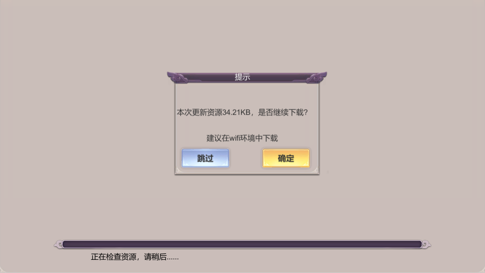

## 前言

在KSFramework中，之前并没有提供资源包更新的具体功能。

因资源包更新同时还涉及到资源文件服务器的整合、资源包的制作这些耦合的功能。

您可以参考作者的另一个项目，[resources_packer](https://github.com/mr-kelly/resources_packer)提供资源差异包的制作功能。

要实现更新的机制非常之多，最常见的更新莫过于启动时进行更新。但是基于KSFramework热重载的特性，建议可以更多的考虑运行时静默的下载更新，静默重载。

在经过几个项目的迭代之后，也有一些朋友问我能不能给KSFramrwork加入下载资源的功能，现在我决定加入这项功能。

注意：制作更新包所使用的脚本为python，所以需要在你的机器上安装[python3](https://www.python.org/)

## 文件唯一标识

如何判断一个文件是否需要更新呢？当然是有变化的文件才需要更新，那么我们就需要给每个文件一个唯一标识，当标识变化时，就认为需要更新。这里讲两种方法，在KSFramework中采用md5做为文件唯一标识。

### 文件修改时间不可靠

我遇到有的项目是手动管理ab依赖，采用文件修改时间做为唯一标识，因为在打包ab时，如果资源没有变化则不会打包，那么ab的修改时间就不会变化。可以设置从svn更新的文件就是文件的提交日期《[svn把文件日期设置为最后提交的时间](https://www.cnblogs.com/zhaoqingqing/p/14545483.html)》。

但是使用unity自动管理依赖的话，在同一台机器上且不删除Library目录的情况下，对同一资源重复打包，文件的修改时间也不会变化，但如果更换机器或删除Library则会变化。在我们多个实际项目中，都是会有一台稳定的打包机，打包工作在打包机上执行。但如果删除ab重新打包则修改时间会变化

### 使用md5做为唯一标识

把ab删除后，重新打包，md5不会变化

## 制作差异补丁

## ab资源列表(filelist)

按照ab划分粒度不要太细的原则，在实际项目中ab文件不会出现太多小文件，所以采用下载单个ab的方式。

在使用http下载大量文件时，可以在header添加keep-alive用于复用socket，减少大量的connect(如果是http1.0需要处理，http1.1默认已开启)

用法：

生成filelist脚本放置在build_tools目录，在[jenkins](https://www.jenkins.io/)中根据平台来执行对应的bat脚本，底层是调用python脚本(gen_filelist.py)来生成filelist

### version.txt

使用fielist.txt的修改日期做为版本号，当删除全部资源并重新生成后，文件的日期会发生改变，所以需要每次运行脚本前会自动备份旧的filelist到脚本目录用于对比文件内容。

### lua和settings(配置表)

建议把差异打包成一个zip下载后解压，那么如何制作差异文件呢？

方案一

远程服务器的文件与发布机的文件进行对比，挑选出差异文件，然后把差异文件打包为zip，但这里面会有一个问题，如果中途更新了几个版本，而新玩家与老玩家要下载的差异文件是不相同的，那么就要制作不同版本的差异zip，这个维护过程是比较复杂的

方案二

不制作差异补丁，直接下载单个文件，我们有个ILRuntime热更新的项目就是这么干的，这样简单省事，但是会碰到CDN下载小文件速度非常慢的问题，而如果是Lua的话会有非常多的小文件，不建议这么干。

方案三(默认)

有个简单的做法，把全部的lua文件打包一个zip，每次都完整下载，我们有一个mmo项目，全部lua源代码是10MB，压缩成zip之后只有3MB，这个大小是可以接受的，同理配置表文件也可以这样处理

## 资源冗余

在开发期删除有设置abName的prefab，再重新打包ab，ab目录中不会删除这个prefab还会保留，自动和手动管理依赖都会存在这个问题。在我们项目中会定期执行删除全部资源，然后重新导出全部资源，以此来清除无用资源。

## 下载更新资源和演示

目前是在游戏启动时(下载功能放在不可热更层)，进行下载资源，默认已关闭下载更新功能，可在Appconfig.cs中IsDownloadRes=true打开。

TODO 增加下载完整包的功能

### 提示更新

### 显示更新进度

## 使用说明

从git上拉取KSFramrwork之后打开build_tools目录

1. 双击生成filelist-xxx.bat，生成filelist
2. 双击gen_hotfix_res，制作更新资源包
3. 双击hfs，启动hfs(可一直运行不关闭)，拖动cdn目录到hfs中
4. 运行游戏即可更新资源

更加详细的操作和说明，请查阅build_tools目录下的README.md

## 可能存在的问题

下载过程中退出游戏，下次启动，是否会继续上次下载的进度/解压zip