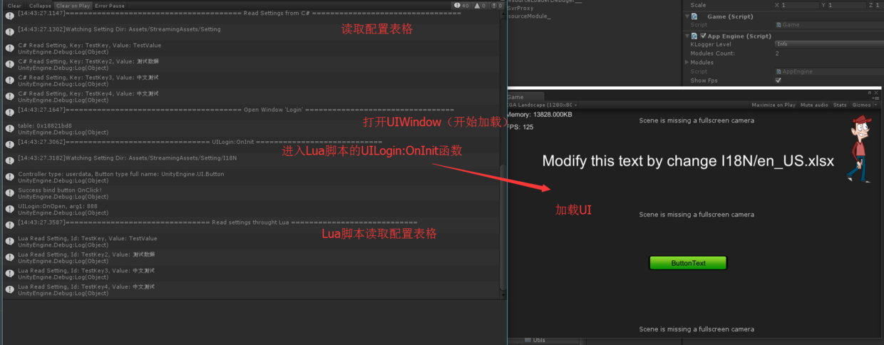
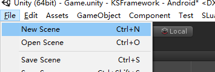
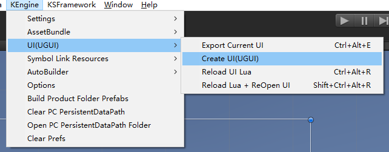
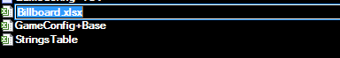
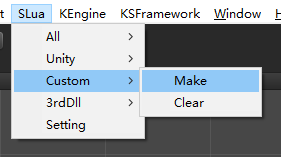
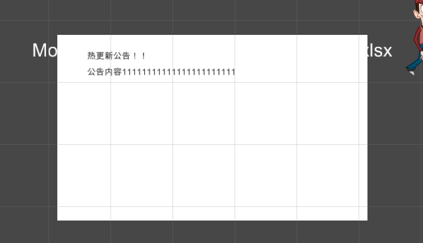

## 前言

从github拉取代码下来之后，需要点击KEngine - Open Quick Window，在打开的窗口中，进行以下操作

1. 点击生成ab
2. 如果是ILRuntime分支，还需要点击生成dll，xlua/slua则无需

注意：经过多个不同项目组之后，文档中的部分内容未及时更新，如遇到使用上的问题请先阅读源码。

## 看看Demo！

双击打开Assets/Game.unity场景，点击播放。


> 开始Game.unity后的日志输出

这时候KSFramework的默认Demo开始，做了这些事情：

- 基础模块的启动
- Lua模块的启动
- 尝试读取并打印Excel表格GameConfig.xlsx内容
- 加载UI界面Login
- 执行UI界面Login的Lua脚本
- Lua脚本绑定UI控件、设置UI控件
- Lua脚本读取并打印Excel表格GameConfig.xlsx内容

总而言之，这个Demo囊括了KSFramework中的几个核心模块的使用：

- KEngine中的Setting模块的使用
- KEngine中的UI的资源加载
- SLua/XLua脚本引擎与UI的联合

接下来，将模仿这个Demo，创建/加载一个新的UI界面、创建/读取一个新的配置表格。

## 尝试做一个公告界面Billboard

接下来，我们将创建一个UI公告牌（Billboard），使用Lua脚本，并从配置表读取公告内容。

### 创建UI资源

> 创建New Scene



> KEngine-UI-Create UI创建UI布局


> 点击Create UI后，默认随机名字，把UI名字修改为Billboard


> 修改UI名字为Billboard，UI界面右边带有黄色UI标识


> 编辑一下UI场景，一个背景Image，两个Label


> 保存一下场景，保存到Assets/BundleEditing/UI/Billboard.unity


> 导出——打包AssetBundle，快捷键Ctrl+Alt+E

### 加载UI界面

好了，Billboard界面创建好了，也导出成了AssetBundle。
接下来，我们通过代码打开界面。

> 编辑Assets/Code/Game.cs

在OnGameStart函数的末端，加上这样的一句：
```csharp
// 开始加载我们的公告界面！
UIModule.Instance.OpenWindow("Billboard");
```

完成。 打开场景Assets/Game.unity，点击播放按钮：


> 我们的UI通过AssetBundle打开了，弹出提示找不到UI Lua脚本，接下来我们创建Lua脚本吧。

### 创建Lua脚本


> 在目录Product/Lua/UI中新建一个lua文件


> 写一段Lua代码：UIBillboard的执行逻辑

```lua
local UIBase = import("KSFramework/UIBase")

local UIBillboard = {}
extends(UIBillboard, UIBase)

function UIBillboard:OnInit(controller)
    self.Controller = controller
    self.TitleLabel = self:GetUIText('Title')
    self.ContentLabel = self:GetUIText('Content')
end

function UIBillboard:OnOpen()
    self.TitleLabel.text = "This is a title"
    self.ContentLabel.text = "Here is content!"
end

return UIBillboard
```
这段lua中，创建了一个Table叫UIBillboard，这个table必须有OnInit(controller)函数。它通过代码设置了UI中的文字。

好了，接下来，我们要为策划准备配置表了。

### 创建配置表

**说明：新版本中增加了把配置表数据生成为lua文件，或者把配置表数据插入到sqlite中，均可以做到配置热重载。**

打开Product/SettingSource目录，复制一份StringsTable.xlsx，并改名叫Billboard.xlsx吧


> 复制一份StringsTable.xlsx

用Excel打开我们新的Billboard.xlsx，编辑我们的公告。我们大概定一下需求，我们假设写入3条公告，每次打开公告随机显示其中一条。每个公告，我们给它一个英文ID，一列中文标题，一列中文内容。

Excel表修改如下：


> 增加公告内容


> 回到Unity，监测到Excel变动。点击OK。


> 上一步监测到变动，只编译Excel表，手动执行一些重新编译，并生成配置表代码


> 这时候，打开AppSettings.cs代码文件，我们可以发现，已经生成名叫BillboardSettings的类了


> 因为我们要在Lua使用BillboardSettings读取配置表，这里需要**重新生成一下SLua的静态代码**
>
> 如果是xLua在编辑器下可以不生成Wrap代码，如果是使用lua来保存配置表数据(tableml有提供此功能)，热重载配置还在计划中


> 接下来修改Lua代码，随机读取一条公告，并设置Content、Title


> 运行播放Game.unity，我们的公告界面完成了

公告界面完成了。我们创建了一个UI、写了C#和Lua代码加载它、然后创建了一张配置表，再从Lua读取配置表，设置UI的显示。

## 玩玩热重载

### 热重载Lua
接着我们刚才运行的Game.unity。 我们尝试一下对Lua热重载：在不重启游戏的情况，快速重载Lua代码，方便程序调试。


> 菜单KSFramework->UI->Reload+ReOpen：热重载Lua脚本，并重新打开目前处在打开状态的UI界面

我们可以从菜单执行热重载并重新打开UI界面，或者使用快捷键Ctrl+Alt+Shift+R。
由于我们的Lua脚本中，每次执行随机获取一条公告。因此可以看到公告内容在不停的变动着。

热重载的实现，主要依赖于每个lua脚本的最后一行——return Table；C#层在执行完Lua脚本后，会把这个返回的Table缓存起来，每次需要使用table时，直接从缓存拿；而热重载，实际就是把这个缓存table删掉，这样当需要用到这个table时，就会重新执行Lua文件，来获取Table，这样就达到了热重载得目的。

### 热重载Excel表格

我们保持运行刚刚的Game.unity，不要停止掉。这时候我们去修改Excel表格。


> 修改Excel表格，保存后，回到Unity，提示表格有改动。
> 注意表格的内容，根据Lua代码，三个Id分别是Billboard1，Billboard2，Billboard3


> 发现表格有变动，点击OK编译表


> 从菜单中心一下重载配置表格吧


> Ctrl+Alt+Shift+R刷新Lua

重载Lua，我们的新修改的配置表内容生效了。

至此，我们的Lua和配置表的改动，都可以在不重启、不重新转菊花的情况下快速修改。
