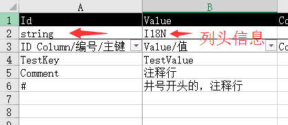

## 自定义解析

分析配置表模块自动生成的代码，会发现，所有的XXXSettings类都使用partial修饰的。因此你可以扩展partial类来实现自己的字符串解析。

```csharp

    public partial class GameConfigSetting
    {
        public int IntValue {
            get
            {
                int intValue;
                if (!int.TryParse(Value, out intValue))
                    return -1;
                return intValue;
            }
        }
    }
```

如上示例，为GameConfigSetting配置项增加一个IntValue的Getter，自动将读取到的Value字符串，强制解析成数字整形。


## 扩展列的类型

配置表模块在编译时，把Excel转化成TSV，并根据Excel的头部信息，生成对应的代码； 比如源码库中的Test.xlsx Excel文件，两个列头，Id和Value，其下的列头信息标注其分别是string和I18N。 这是对这两个列的类型声明。



在生成代码的时候，会把其类型作为代码的一部分，写入到代码中：

```csharp

	/// <summary>
	/// Auto Generate for Tab File: "Test.bytes"
    /// Singleton class for less memory use
	/// </summary>
	public partial class TestSetting : TableRowParser
	{

        /// <summary>
        /// ID Column/编号/主键
        /// </summary>
        public string Id { get; private set;}

        /// <summary>
        /// Name/名字
        /// </summary>
        public I18N Value { get; private set;}


        internal TestSetting(TableRow row)
        {
            Reload(row);
        }

        internal void Reload(TableRow row)
        {
            Id = row.Get_string(row.Values[0], "");
            Value = row.Get_I18N(row.Values[1], "");
        }

        /// <summary>
        /// Get PrimaryKey from a table row
        /// </summary>
        /// <param name="row"></param>
        /// <returns></returns>
        public static string ParsePrimaryKey(TableRow row)
        {
            var primaryKey = row.Get_string(row.Values[0], "");
            return primaryKey;
        }

```

其中，生成的代码，总结生成的核心是：
```csharp
// string                   // string
string Id = row.Get_string(row.Values[0], "");
// I18N                      // I18N
I18N Value = row.Get_I18N(row.Values[1], "");
```

代码中，会引用I18N类、Get_I18N方法。
默认情况，KEngine的TableRowParser提供了string、int、bool等常见类型的解析方法，而像I18N这样的一个类，则是通过C#的扩展功能，扩展KEngine中的TableRow类型，来自定义解析配置表读取的方法。

```csharp
// 定义类
public class I18N
{
    public I18N(str) {}
}
// 定义扩展方法
public static class I18NExtensions
{
    public static I18N Get_I18N(this TableRow tableRow, string value, string defaultValue)
    {
        var str = tableRow.Get_string(value, defaultValue);
        return new I18N(str);

    }
}
```

这样做之后，配置表自动生成的代码就能正确的按照你自定义的方法进行解析了：

```csharp
I18N Value = row.Get_I18N(row.Values[1], "");
```
