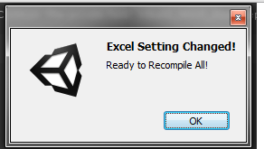
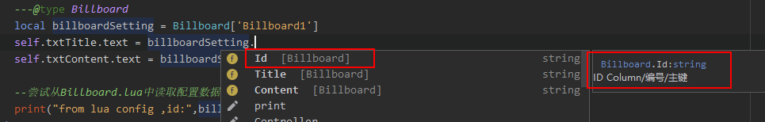
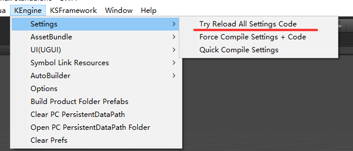

## 配置表——策划与程序的桥梁

执行策划在游戏开发的过程中的主要工作是什么？当然就是和Excel打交道了。大量的Excel数据表，最终会被演变成游戏的配置数据。日常游戏开发中，策划编辑配置表一般有两种方式：

- **编译式**：策划编辑Excel，经过中间程序转成csv、lua、json等程序可读的文本格式；
- **直接撸式**：策划直接编辑Lua和使用Excel编辑TSV（CSV）等程序可读的格式；

而程序读取，理论上也因此有几种方式：

- **自动生成配置读取代码**：自动根据策划编辑的Excel和规范，自动生成所有加载配置表的代码；
- **手工写读取配置表的代码**：这是常见的方式，但往往一个项目下来，手写的配置表的代码不但大量，而且伴随策划配置的修改需要频繁的维护；

对策划来说，直接撸Lua或csv，体验肯定不如直接编辑Excel来得爽快；对程序来说，读表这种无技术含量的重复劳动，自然不如自动来得爽快。

[KEngine](https://github.com/mr-kelly/KEngine)中的配置模块，使用了编译式配置表，对Excel表有轻度的规范，策划可以根据自身需要，添加文档、注释、图标、批注等等各种辅助信息；并自动化生成出程序代码配置表加载API，供程序直接使用。

## 配置表的编辑和编译

[KEngine](https://github.com/mr-kelly/KEngine)中，配置表源文件，即编译前的表，默认放置在Product/SettingSource目录中；编译后的配置文件放置在Assets/StreamingAssets/Setting目录中。

### Excel表格规则

该目录的Excel文件都要遵循以下的4条规则：

1. **第一个表单（Sheet）为需要编译的内容**；
- **表单的第一行是列名，如Id，Name等**；
- **表单的第二行是列配置信息，如string/default，表示此列的数据类型是string字符串类型，默认值是default； [KEngine](https://github.com/mr-kelly/KEngine)目前只使用前两位信息**；
- **表单的第三行是注释，可以添加对列名的一些解释，最常用莫过于为英文的列名配上中文的注释了**；

最终效果如图：


### 注释的行或列

除了第三行注释行，配置表模块还有两个添加注释的规则：

- 表单中，非头三行内容，行的第一个单元格内容为“##”或“Comment”时，认为这一行是注释行；
- 表单中，列名单元格内容为“##”或“Comment”时，认为这一列是注释列；

### 拆分表格

日常的开发中，我们有时候会嫌一个Excel文件内容过多，希望将其进行拆分；同时也方便多人协作。


[KEngine](https://github.com/mr-kelly/KEngine)在编译时，对文件名处理施展了一点点魔法：**当文件名中存在+号时，会裁掉+号后边的内容**。

比如这3个文件：AppConfig+A.xlsx，AppConfig+B.xlsx，AppConfig+C.xlsx，在编译时，会统一合并成AppConfig.xlsx。

但是要注意，务必确保这三个文件的表头信息要一样的。

### 配置表格的编译


TSV，即Tab-sepertated Values，类似CSV表格，仅仅是分隔符从逗号变成了Tab。 就我公司所经历的所有游戏项目，策划均直接用Excel撸TSV格式配置表。

KEngine配置表编译的本质，其实就是——**把Excel文件转换成纯文本TSV格式文件**。而在编译过程中，会删掉注释内容：第三行的注释，带##井号的注释等。

上图中的Excel，经过编译后变成的TSV文件内容：


### 如何在Unity中触发KEngine对Excel表格编译？


执行菜单KEngine->Setting中的两个编译配置表功能项：

- **Force Compile Settings + Code**：强制重新编译所有的表，并且自动生成配置表代码（会触发Unity重新编译）
- **Quick Compile Settings**：差异化编译配置表，不重新自动生成配置表代码

### 配置表的文件监测

为了方便开发，在打开Unity编辑器后KEngine会对所有的配置表源文件进行监测，当发现Excel文件有改动，Unity编辑器就会弹框请求进行配置表重新编译（执行**Quick Compile Settings**差异化编译）



不过，当修改配置表时并没有打开带有KEngine的Unity工程，就无法监测到配置表的变更，这时就需要手工执行菜单的配置表格编译了。

## 配置表读取的代码生成

### C#+Tsv读取配置文件

根据Excel配置表的头部信息，KEngine会在Unity的Assets根目录（可通过EngineConfigs.txt这个INI文件进行配置）生成一个AppSettings.cs文件。这个文件包含了所有的配置表的读取代码。

直接来看看配置表代码的调用方法——获取所有、获取某个、热重载：
```csharp

// 获取所有的配置项
foreach (GameConfigSetting config in GameConfigSettings.GetAll()) // Get all Configs
{
    Debug.Log(string.Format("C# Read Config, Key: {0}, Value: {1}", config.Id, config.Value));
}

// 获取指定Key的配置项，Key为第一列
var testConfig = GameConfigSettings.Get("Test"); // Get by key

// 热重载
GameConfigSettings.GetInstance().ReloadAll(); // Reload while settings recompile
```


Excel表GameConfig.xlsx，会生成一个类GameConfigSettings，放置在AppSettings.cs代码文件中。

### 使用Lua做为配置表文件

新版本增加了把excel的内容生成到Lua文件中，在lua端做为一个table直接读取配置文件内容，就无需通过c#+tsv方式来读取。

Lua文件中的前几行注解，是用于配合EmmyLua插件在IDEA下可实现代码提示功能，使用效果如下图：


关于如何使用EmmyLua来编写Lua，可参考我的文章《[在Lua中提示UnityEngine.dll的方法](https://www.cnblogs.com/zhaoqingqing/p/8296753.html)》和《[在Unity中对Lua进行调试](https://www.cnblogs.com/zhaoqingqing/p/9121991.html)》

生成的配置文件格式如下：

```lua
---auto generate by tools
---@class Billboard
---@field public Id string ID Column/编号/主键
---@field public Title string 公告标题
---@field public Content string 公告内容
return {
["Billboard1"] = {
	Id="Billboard1",
	Title="公告1XXXXXXXX",
	Content="公告内容aaaaaaaa"
},
---此处省略更多的数据内容
["Billboard4"] = {
	Id="Billboard4",
	Title="公告4",
	Content="公告内容4444444444444444444444"
}
}
```

### 切换配置项

在EngineConfigs.txt 或 AppConfigs.txt 这个INI文件修改字段 IsUseLuaConfig = 0 的值来进行切换

### 热重载

对策划来说，简单的修改Excel配置表后，往往需要重启游戏，来看修改的效果。

KEngine配置表提供一种方法，可以在不重启游戏的前提下，重载配置表，来立即查看效果。

生成的配置表代码中，会监测其加载过的编译后的配置文件，当配置文件发生变化，就会进行重载。

如果文件监测失灵，你也可以通过菜单项来主动重载：




## 其他

既然KEngine中使用了Excel这种非纯文本格式进行配置表的编辑，那么在配合SVN等版本管理工具时，如何进行差异化的配置表比较？可参详：[《KEngine：Excel如何进行SVN协作、差异比较？》](http://www.jianshu.com/p/2ea5468e9d5b)
