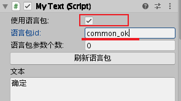
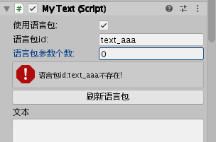

## 游戏语言包

游戏里出现文字，包括代码中用到文字，UI上的文本，全部从语言包读取，而不写在代码或UI中，这样做有以下几点好处：

1. 方便策划调整文字，而不需要找技术修改
2. 当项目大到一定程度时，直接改语言包就可以，减少打开UI或查找代码的时间
3. 方便的提供给翻译员翻译成其它语言（外包翻译服务是按字收费）
4. 多语言不使用excel，直接放到txt中，方便上线运营后的版本迭代进行diff

当然在其它的配置表也是依然会出现文字的，这也是支持的，并不是说要把其它配置表中的文字全部提取到一起，而是对于游戏内的提示文字或者UI上描述放在单独的语言包中配置，避免拼到界面或写到代码中。

语言包放在**SettingSource\I18N**下，每增加一种语言就增加一个**lang--语言.txt**，默认是lang.txt(中文)

语言包的配置格式为key=value，#开头为注释行，示例如下：

```json
#格式：key=value
#下载和更新
download_title_tips=资源更新
```

## 配置表多语言

SettingSource下有很多的配置表(excel)，每张表都有不同的内容。

配置表多语言有两种做法，项目可根据自己实际情况来选择：

1. 所有语言都使用同一份配置表，通过配置表条件编译，为每个需要翻译的字段增加一列
2. 每个语言都有一份配置表，里面的差异就是要翻译的字段内容不同，或者进行小范围的数值调整，如果某表不需要翻译则可以不提供，会读取默认名字的配置表

对于方案1或或2，在商业项目中打包时我们是写了python脚本根据语言拷贝要的资源到APK包内。(注：python脚本还未提供，因为里面有些要根据项目实际情况来处理)

## 为什么每个语言一份配置表？

在多个项目中实践下来，这套模式在维护成本和自由度比较适合我们团队，当然之前的模式还是支持的，用户可根据项目情况来选择适合的模式。

在之前版本中KSFramework对于同一份配置表，不同语言通过if条件编译符来区分，这套模式还是支持的。原理是在导表的时候根据语言导出指定的内容。

现在新的模式是一张配置表，在每个语言都有一份同名但后面加了--cn，--en，--hk的配置，这样自由度是比较大的，可以把配置发给外包进行翻译。

### UI编辑器中使用多语言

在KSFramework中的文本多语言和正常操作一样，通过Unity的菜单创建一个Text，你的使用习惯不需要改变。

当我们在KSFramework中创建Text时，它有一个使用语言包的勾选框，默认是勾选的，然后就可以输入语言包中的id，文字就从语言包读取到文本中了。

常见的语言包有这几种情况

1. 输入lang.txt中的id，就会读取到Text上，示例语言包：`common_ok=确定`



2. 如果这条文本有参数，则填上参数个数，参数会填充到占位符上，示例语言包：`text_datetime=后面是一个占位符:{0}`


3. 如果语言包id输入错误或者不存在，则会有提示



## 代码中使用多语言

在C#中的占位符是{0}，而lua中是%s或%d来占位(当然lua也可以全部使用%s来占位)。

建议在配置表中使用占位符时，如果该表是C#中用就使用{0}{1}，而如果只在lua中读取的表，就使用%s来代表占位。

```c#
gameobject.GetComponent<MyText>().SetText(I18N.Get("common_ok"));
```
