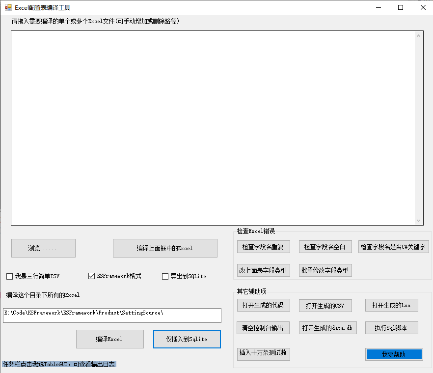

## 编译配置表工具

当项目组的人数越来越多，或者配置表数量越来越多，或者出于其它目地希望把编译配置表拆分出来一个独立的工具不依赖于Unity，就需要有一个GUI工具来编译配置表，本篇讲解这个TableML的GUI工具

（注：目前只提供windows版本，如果是mac os 或linux 需要使用Unity进行编译配置表或 自行通过.net core进行编译gui版本）

[GUI工具下载](https://github.com/zhaoqingqing/TableML/releases/download/v2.0/tableml_gui.zip)

## GUI界面

## 快速开始

参考作者的这篇文章：[GUI工具-快速开始](https://github.com/zhaoqingqing/TableML/blob/custom/quick_start.md)

[GUI工具-更新日志](https://github.com/zhaoqingqing/TableML/blob/custom/update_log.md)

[二次开发](https://github.com/zhaoqingqing/TableML )（如果你们的excel有特殊格式或者需要自定义格式，可以修改源代码进行定制，参考 [README](https://github.com/zhaoqingqing/TableML)）

### 修改配置

可通过gui.exe目录下的App.config进行配置，或者在界面上通过勾选来修改配置