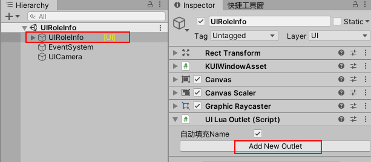

拖拽绑定控件有以下几个规则：

- 需要手动在UI编辑器中拖拽UI控件，而无需手写FindChild代码就可以使用
- 在同一个UI中不允许出现相同的Name(即不能有相同名字的变量)，否则Name会出现红色提示
- 当Object为空时(未赋值或丢失)，会出现红色提示


## LuaOutlet 拖拽绑定控件

在KSFramework中，拖拽绑定控件的步骤如下：

1. 打开UI界面，选中UI的根节点，查看Inspect面板，它上面绑定了LuaOutlet脚本
2. 如果是新界面则点击Add New outlet，如果已有控件则点击+号，创建一个新变量
3. 拖拽要绑定的控件到Object处，在Component处下拉选择你的控件类型
4. 在UI代码中使用self.变量名就可以访问这个控件了，而无需写FindChild

每个变量都有三个内容：

```lua
Name：在Lua代码中访问这个对象的变量名
Object：控件指向Unity的Object
ComponentType：控件的类型，比如它是按钮还是文本，还是输入框
```
创建一个变量



拖动控件给变量赋值和选择类型


## 在代码里引用拖拽的控件

在Editor中绑定控件之后，在UI代码里可以直接self.xxx使用这个控件了，比如：

```Lua
self.txtTitle = "标题文字"
self.btnLogin.onClick:AddListener()
```

拖拽绑定的变量框架在界面初始化时会自动对进行赋值，调用luaTable.Set，压入self作用域中。

实现代码可查看：**LuaUIController.SetOutlet**

## 可视化查找引用丢失

在代码中通过路径查找控件，而如果这个控件后来因于UI的结构修改而被删除了，或者美术、策划调整了UI层级结构，这个路径就找不到对应的控件，从而变量变成了Null， 程序对变量的访问就会引发NullReferenceException。 如果经常出现这种问题的话，让技术同学去检查路径是一种浪费不必要的时间。

而outlet则提供可视化的方法，在Inspect面板会**以红色标识丢失的引用，和具有同名的变量**。


## 多个outlet

当UI界面比较复杂时，如果全部的控件都绑定在一个outlet，那么后续的维护成本会增加，不易查找到指定的控件，根据实际项目我们有以下建议：

- 界面的*每个块级元素*使用一个outlet
- 每个功能点一个outlet
- 每个区域一个outlet(顶部，中部，左侧，右侧)

在界面的根节点增加UILuaOutletCollection，并把当前界面中用到的outlet拖到这里来

