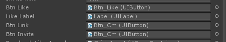

在KSFramework中，提供两种方式进行控件绑定：

1. 通过代码手工实现控件的绑定
2. 通过拖拽的方式绑定(LuaOutlet)


本篇讲解通过代码手工实现控件的绑定

```Lua
-- Type and Path
local button = self:GetControl('UnityEngine.UI.Button', 'path1/path2/button')
```

通过指定控件的类型和相对路径，即可获取到指定的控件。


# 为什么不用拖拽的方式绑定？



另一种方法，控件的绑定，是可以像通过编辑器的拖拉来实现。即在Unity编辑器中，拖拽控件到右边的Inspector，可视化的向脚本赋值。之所以采用代码手工实现，是出于几点考虑：

## 控件的拖拉，更多是程序操作

用拖拽的方式，最初的设计估计是可视化编辑。

但是到了最后，由于使用哪一些控件，只有程序自己是最清楚的，更多的是程序同学自己做拖拽，起不到可视化的作用。

## 控件太多，分不清具体

当一个UI中拖拽的控件很多（比如100个），编辑器边栏密密麻麻的布满控件。而且这些控件都是以变量名称存在的，正常人根本无法区分，具体的变量对应什么控件。 反而直接码到代码里，添加注释，更加的清晰。

## 引用丢失的情况

当UI中拖拽绑定控件，如果这个控件后来因UI的结构修改而被删除了，这个变量就变成了Null。 程序对变量的访问就会引发NullReferenceException。 这种问题出现的时候，非常的不好查。
